# Option trading and analysis

Designed for educational purposes. Here are some of the key topics:


- **Data request** : Recovery of Option & stock financial data via the yFinance API
- **Option Trading Strategies**: We'll explore various strategies for trading options, including both traditional and more exotics techniques.
- **Black & Scholes Pricing Model**: Implementation of the theoretical foundations of the Black & Scholes model: A comparison with the binomial model.
- **Implied Volatility Surface / Local Volatility**: Recovery and calculation of implied volatilities quoted on the market. Observing the long and short term skew/smile
- **Stochastic Volatility**: We'll explore the concept of stochastic volatility with Heston Model
- **Greeks**: We'll cover the key "Greeks" (Delta, Gamma, Theta, Vega, Rho) and their profiles with different options strategies.


----------------------


**Data Retrieval**

The initial step in this code utilizes the yahoofinance API to access financial quotes. This is achieved through the use of the internal modules *y_finane_option_data* and *y_finane_stock_data*, which are utilized to retrieve option and stock data for a specific ticker symbol.

During all the analysis of Read.me we will use as symbol *TSLA*


Here is the simplest code to retrieve data:

```ruby

from DataRequest import  y_finane_option_data , y_finane_stock_data

# Choose the instruments you want to recover
ticker = 'TSLA'

## Get Option & underlying stock price
option_df = y_finane_option_data.get_option_data(ticker)
stockPrices_ = y_finane_stock_data.get_stock_price(ticker)
```

Click here to access to dataFolder scprit [Data Request folder](https://github.com/AdrienCss/OptionTrading/blob/main/DataRequest)

Example of output with TLSA: 

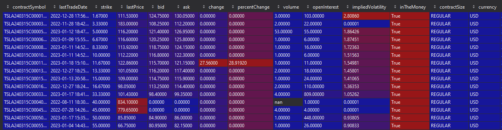

# **Creating Option trading stategies**

- [mainOptionStrategies.py](https://github.com/AdrienCss/OptionTrading/blob/main/mainOptionStrategies.py)<=


In this script, we will construct a variety of strategies using real optional data.
We will establish  "Option"& "Stocks" data type and devise distinct strategies from it. 
Additionally, we will plot the corresponding Payoff profiles for these strategies. We will have the capability to display the Greek profiles of these strategies, projected over a range of underlying prices. This will allow us to analyze and evaluate the potential outcomes and risks associated with each strategies.

In the case of the following strategies we have taken real options that quote the market on the underlying TSLA. 

Click here to see the code of the strategy Engine =>  [OptionStrategies.py](https://github.com/AdrienCss/OptionTrading/blob/main/Option/OptionStrategies.py)<=

```ruby

# We take the 5th closest maturity
maturity =option_df['T_days'].unique()[5]

options_df = option_df[option_df['T_days'] ==maturity]
call_df = options_df[options_df['Type'] =='CALL']
put_df = options_df[options_df['Type'] =='PUT']

#Getting real Quotes options
call_90_df = call_df.iloc[(call_df['strike']-(currentprice * 0.90)).abs().argsort()[:1]]
call_80_df = call_df.iloc[(call_df['strike']-(currentprice * 0.80)).abs().argsort()[:1]]

put_90_df = put_df.iloc[(put_df['strike']-(currentprice * 0.90)).abs().argsort()[:1]]
put_80_df = put_df.iloc[(put_df['strike']-(currentprice * 0.80)).abs().argsort()[:1]]


# Creating Call spread  80 / 90
call90 = Option(price=call_90_df['lastPrice'].values[0], K=call_90_df['strike'].values[0] , type= OpionType.CALL)
call80 = Option(price=call_80_df['lastPrice'].values[0], K=call_80_df['strike'].values[0] , type= OpionType.CALL)


strategy = OptionStrategies(name = "Call spread 90/80" ,St = currentprice)
strategy.add_Option(option= call90 ,buySell= BuySellSide.SELL , option_number=1 )
strategy.add_Option(option= call80 ,buySell= BuySellSide.BUY , option_number=1 )
strategy.plot()


# Creating put spread  80 / 90
put90 = Option(price=put_90_df['lastPrice'].values[0], K=put_90_df['strike'].values[0] , type= OpionType.PUT)
put80 = Option(price=put_80_df['lastPrice'].values[0], K=put_80_df['strike'].values[0] , type= OpionType.PUT)


strategy = OptionStrategies(name = "PUT Spread 90/ 80" ,St = currentprice)
strategy.add_Option(option= put90 ,buySell= BuySellSide.BUY , option_number=1 )
strategy.add_Option(option= put80,buySell= BuySellSide.SELL , option_number=1 )
strategy.plot()
```


Put Spread Payoff 80%/90%            | Call Spread Payoff 80%/90%
:-------------------------:|:-------------------------:
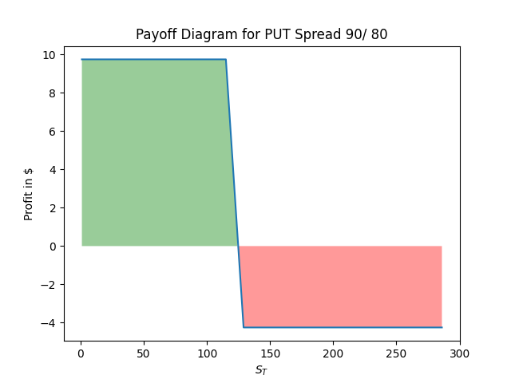  |  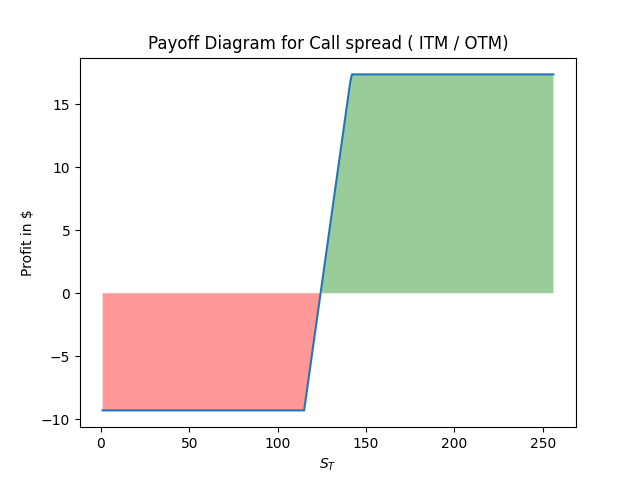


-Butterflies , Straddle , Strangle


Straddle Payoff             | Strangle Payoff
:-------------------------:|:-------------------------:
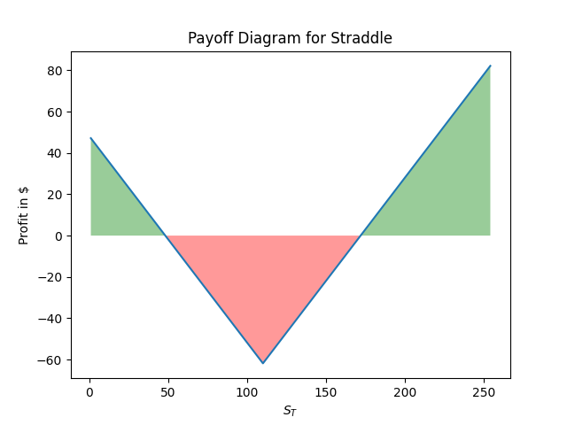  |  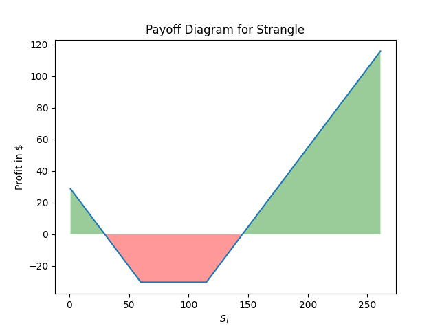


Long Butterfly spread           | Short Butterfly spread
:-------------------------:|:-------------------------:
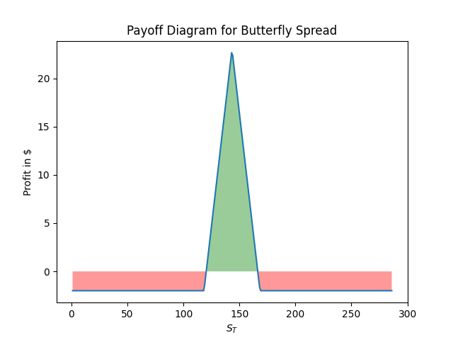  |  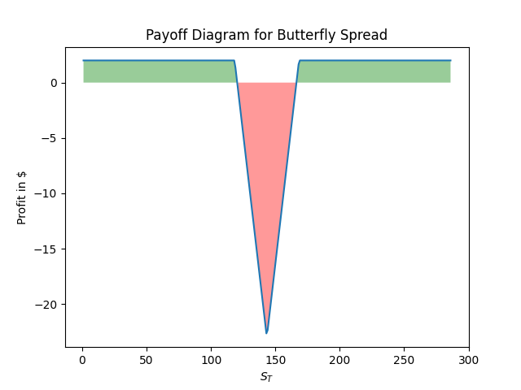


A synthetic call is a combination of a stock and a cash position, such as a long stock position and a short put option position, that simulates the payoff of a long call option. A synthetic put is a combination of a stock and a cash position, such as a short stock position and a long call option position, that simulates the payoff of a long put option. These options strategies can be used to replicate the payout of a call or put option, while potentially reducing the cost or risk associated with buying or selling the actual option.

```ruby
#synthetic call

put_df1 = put_df.iloc[(put_df['strike']-(currentprice - 15)).abs().argsort()[:1]]

put = Option(price=put_df1['lastPrice'].values[0], K=put_df1['strike'].values[0] , type= OpionType.PUT)
stock = Stock(price = last_price)

strategy = OptionStrategies(name = "Synthetic call" ,St = currentprice)
strategy.add_Option(option= put ,buySell= BuySellSide.BUY, option_number=1 )
strategy.add_deltaOne(stock=stock,buySell= BuySellSide.BUY )
strategy.plot()


#synthetic PUT

call_df1 = call_df.iloc[(call_df['strike']-(currentprice - 15)).abs().argsort()[:1]]

call = Option(price=call_df1['lastPrice'].values[0], K=call_df1['strike'].values[0] , type= OpionType.CALL)
stock = Stock(price = currentprice)

strategy = OptionStrategies(name = "Synthetic PUT", St = currentprice)
strategy.add_Option(option= call ,buySell= BuySellSide.BUY, option_number=1 )
strategy.add_deltaOne(stock=stock,buySell= BuySellSide.SELL )
strategy.plot()
```


Synthetic call         |  Synthetic Put
:-------------------------:|:-------------------------:
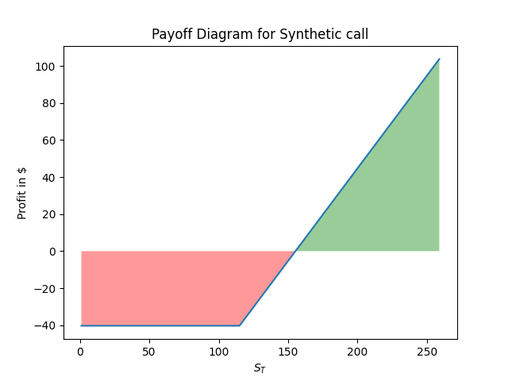  |  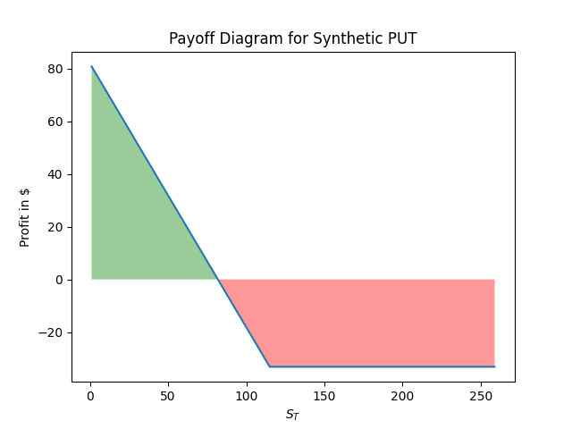


-Covered call/ Put

 **Call Spread Greeks Profile**
The engine also allows you to profile greek strategies.
Here are the results obtained for a call spread

```ruby
T = maturity /252
r = 0.015
vol = np.average(call_90_df['impliedVolatility'].values[0] + call_80_df['impliedVolatility'].values[0])

strategy.compute_greek_profile(T ,r , vol)
strategy.plotGreek(greekStr='gamma')
strategy.plotGreek(greekStr='theta')
strategy.plotGreek(greekStr='delta')
strategy.plotGreek(greekStr='vega')
```

Delta profile             | Gamma Profile
:-------------------------:|:-------------------------:
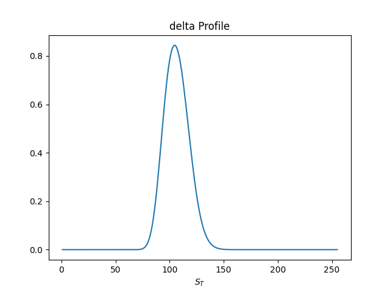  |  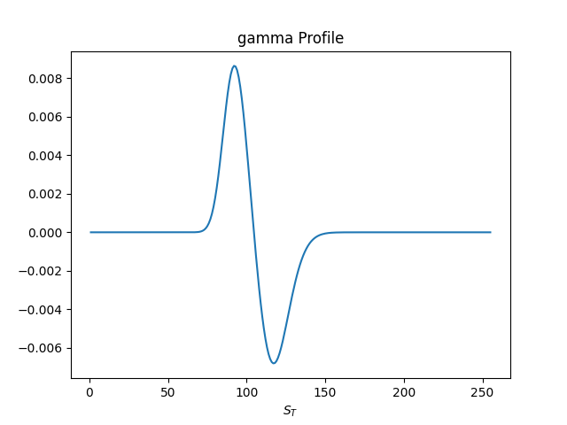
Vega profile             | Theta Profile
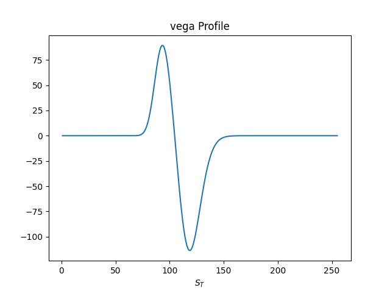  |  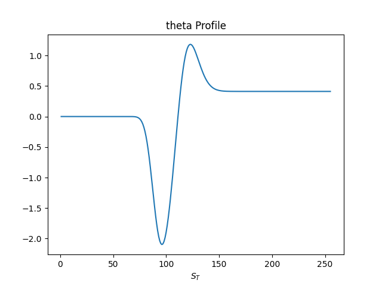


# **Option Princing : Binomial & B&S**

-  [mainPricingModel.py](https://github.com/AdrienCss/OptionTrading/blob/main/mainPricingModel.py)

The B&S model is based on the following assumptions:

- The underlying asset price follows a geometric Brownian motion with constant drift and volatility.
- There are no transaction costs or taxes.
- Trading can be done continuously.
- The risk-free interest rate is constant.
- The option can only be exercised at expiration.

Under these assumptions, the Black-Scholes model provides a closed-form solution for the price of a European call or put option.

The binomial model provides a multi-period view of the underlying asset price as well as the price of the option. In contrast to the Black-Scholes model, which provides a numerical result based on inputs, the binomial model allows for the calculation of the asset and the option for multiple periods along with the range of possible results for each period .
 

```ruby

#Binomial Method 

def combos(n, i):
    return math.factorial(n) / (math.factorial(n - i) * math.factorial(i))


def binom_EU1(S0, K, T, r, sigma, N, type_='call'):
    dt = T / N
    u = np.exp(sigma * np.sqrt(dt))
    d = np.exp(-sigma * np.sqrt(dt))
    p = (np.exp(r * dt) - d) / (u - d)
    value = 0
    for i in range(N + 1):
        node_prob = combos(N, i) * p ** i * (1 - p) ** (N - i)
        ST = S0 * (u) ** i * (d) ** (N - i)
        if type_ == 'CALL':
            value += max(ST - K, 0) * node_prob
        elif type_ == 'PUT':
            value += max(K - ST, 0) * node_prob
        else:
            raise ValueError("type_ must be 'call' or 'put'")

    return value * np.exp(-r * T)
```


```ruby

#B&S Method
def BS_CALL(S, K, T, r, sigma):
    d1 = (np.log(S/K) + (r + sigma**2/2)*T) / (sigma*np.sqrt(T))
    d2 = d1 - sigma * np.sqrt(T)
    return S * N(d1) - K * np.exp(-r*T)* N(d2)


def BS_PUT(S, K, T, r, sigma):
    d1 = (np.log(S/K) + (r + sigma**2/2)*T) / (sigma*np.sqrt(T))
    d2 = d1 - sigma* np.sqrt(T)
    return K* np.exp(-r*T) * N(-d2) - S*N(-d1)


def priceBS(S, K, T, r, sigma ,type='CALL'):
    if type == 'CALL':
        return BS_CALL(S, K, T, r, sigma)
    if type == 'PUT':
        return BS_PUT(S, K, T, r, sigma)
    else:
        raise ValueError('Unrecognized type')

```

# **Implied Volatility Calculation and Plotting for Options**
- [mainImpliedVolatility.py](https://github.com/AdrienCss/OptionTrading/blob/main/mainImpliedVolatility.py)

- Ploting observed implied volatility of real option's quotes.
- Computing implied volatility using Newton-Raphson Model.
- ploting skew/smile on short and long maturites ( short/long Smile)


We can observe implied ( black) volatility Skew at different maturites ( long/short smile)

**Volatility Skew for different maturities ( days)**

```ruby
ticker ='TSLA'

#Requesting stock price
stockPrices_ = y_finane_stock_data.get_stock_price(ticker)

#Compute daily's Log return
stockPrices_['returns_1D'] = np.log(stockPrices_['Adj Close'] / stockPrices_['Adj Close'].shift(1))
returns = stockPrices_['returns_1D'].dropna(axis=0)

# details
kurt = kurtosis(returns.values)
sk = skew( returns.values)

# Compute & plot volatility
stockPrices_['realised_volatility_3M'] =stockPrices_['returns_1D'].rolling(60).std() * np.sqrt(252)
stockPrices_['realised_volatility_6M'] =stockPrices_['returns_1D'].rolling(120).std()* np.sqrt(252)

```

PUT Skew             | CALL Skew
:-------------------------:|:-------------------------:
  |  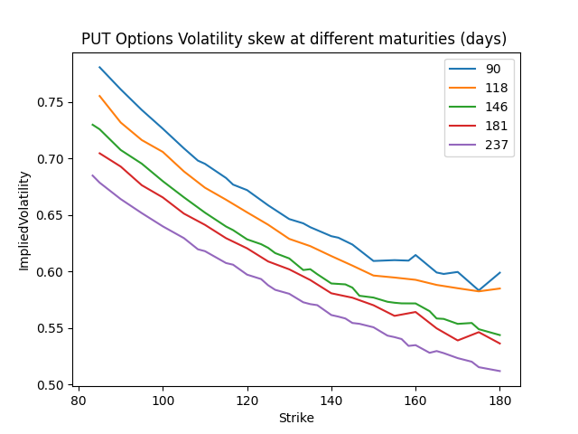


**Observation of Implied Volatility Surface**

```ruby
import matplotlib.pyplot as plt
from matplotlib import cm

## Get Option/underlying stock Prices
option_df = y_finane_option_data.get_option_data(ticker)
stockPrices_ = y_finane_stock_data.get_stock_price(ticker)
last_price = stockPrices_.tail(1)['Adj Close'].values[0]
option_df['underlying_LastPrice'] = last_price

type = 'CALL'
opt =  option_df[(option_df.Type==type)]
opt =  opt[(opt.strike <= last_price+100)]
opt =  opt[(opt.strike >= last_price-100)]
opt =  opt[(opt.T_days <=200)]
opt['MoneyNess'] = opt['underlying_LastPrice'] / opt['strike']
opt = opt[['strike' , 'T_days','impliedVolatility']]

# Initiate figure
fig = plt.figure(figsize=(7, 7))
axs = plt.axes(projection="3d")
axs.plot_trisurf(opt.MoneyNess, opt.T_days , opt.impliedVolatility, cmap=cm.coolwarm)
axs.view_init(40, 65)
plt.xlabel("Strike")
plt.ylabel("Days to expire")
plt.title(f"Volatility Surface for {type} {ticker} - Implied Volatility as a Function of K and T")
plt.show()
```
 Black Implied Volatility OTM |  -
:-------------------------:|:-------------------------:
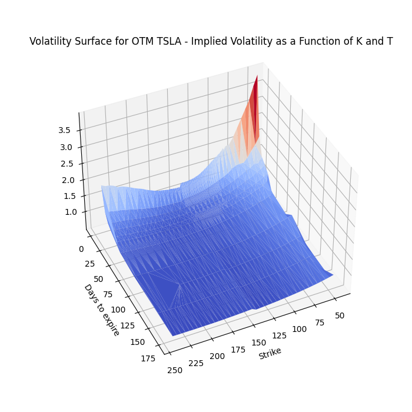  |  -


We can observe it for each type of option also

 Black Implied Volatility CALL |  Black Implied Volatility PUT 
:-------------------------:|:-------------------------:
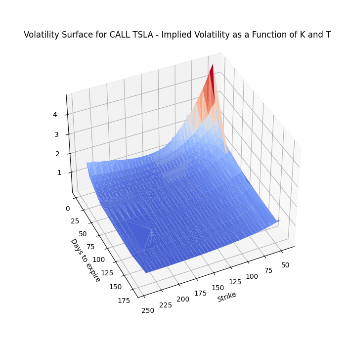  |  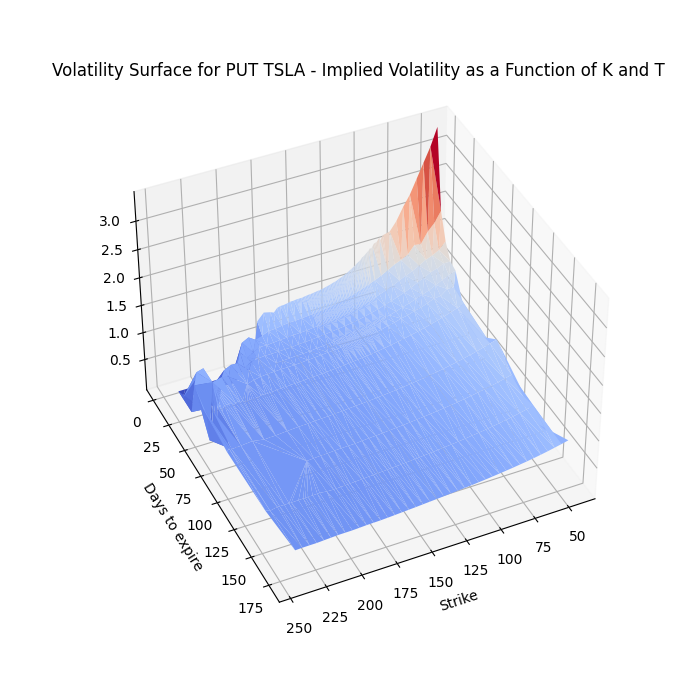


# **Local volatility vs implied Volatility**


Take slice


# **Simulating heston Volatility**

[mainHestonSimulation.py](https://github.com/AdrienCss/OptionTrading/blob/main/mainHestonSimulation.py)
The basic idea behind the Heston model is that the volatility of an asset's price is not constant over time, but rather follows a stochastic process. The model describes the dynamics of the asset's price and volatility using two state variables: the current price of the asset and its current volatility. The model then uses a set of parameters to describe how these state variables change over time.


The Heston process is described by the <font color=blue> system of </font> SDE<font color=blue>s</font>: 

$$ \begin{cases}
dS_t = \mu S_t dt + \sqrt{v_t} S_t dW^1_t \\
dv_t = \kappa (\theta - v_t) dt + \sigma \sqrt{v_t} dW^2_t 
\end{cases}$$

so we can use folowing discretionnary process:

$$ \begin{cases}
S_(t+1) =S_t + \mu S_t dt + \sqrt{v_t} S_t dW^1_t \\
v_(t+1) =v_t + \kappa (\theta - v_t) dt + \sigma \sqrt{v_t} dW^2_t 
\end{cases}$$


The parameters are:
- $\mu$ drift of the stock process
- $\kappa$ mean reversion coefficient of the variance process
- $\theta$ long term mean of the variance process 
- $\sigma$  volatility coefficient of the variance process
- $\rho$ correlation between $W^1$ and $W^2$ i.e. $dW^1_t dW^2_t = \rho dt$

A few brief observations on the TSLA share price

```ruby
ticker ='TSLA'

#Requesting stock price
stockPrices_ = y_finane_stock_data.get_stock_price(ticker)

#Compute daily's Log return
stockPrices_['returns_1D'] = np.log(stockPrices_['Adj Close'] / stockPrices_['Adj Close'].shift(1))
returns = stockPrices_['returns_1D'].dropna(axis=0)

# details
kurt = kurtosis(returns.values)
sk = skew( returns.values)

# Compute & plot volatility
stockPrices_['realised_volatility_3M'] =stockPrices_['returns_1D'].rolling(60).std() * np.sqrt(252)
stockPrices_['realised_volatility_6M'] =stockPrices_['returns_1D'].rolling(120).std()* np.sqrt(252)

```


Returns              | Realized Volatility
:-------------------------:|:-------------------------:
  |  


The kurtosis of 5.08 indicates that the distribution of the data is higher than that of a normal distribution (kurtosis = 3), which means that there are more observations in the extreme values (highs and lows) than one would expect for a normal distribution. The skewness of -0.05 indicates that the distribution is slightly skewed to the left.


In the case of the rolling volatility graph of TESLA stock returns, we can observe how the variability of returns changes over time. The average return to variance is 0.30.


Heston Volatility              | Price trajectories (Monte Carlo)
:-------------------------:|:-------------------------:
  |  


