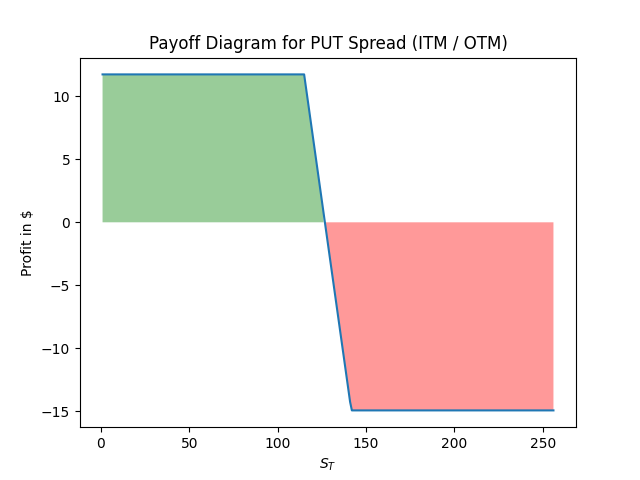

# Option trading and analysis

Designed for educational purposes. Here are some of the key topics:


- **Data request** : Recovery of Option & stock financial data via the yFinance API
- **Option Trading Strategies**: We'll explore various strategies for trading options, including both traditional and more exotics techniques.
- **Black & Scholes Pricing Model**: Implementation of the theoretical foundations of the Black & Scholes model: A comparison with the binomial model.
- **Implied Volatility Surface / Local Volatility**: Recovery and calculation of implied volatilities quoted on the market. Observing the long and short term skew/smile
- **Stochastic Volatility**: We'll explore the concept of stochastic volatility with Heston Model
- **Greeks**: We'll cover the key "Greeks" (Delta, Gamma, Theta, Vega, Rho) and their profiles with different options strategies.


----------------------


**Data Retrieval**

The initial step in this code utilizes the yahoofinance API to access financial quotes. This is achieved through the use of the internal modules *y_finane_option_data* and *y_finane_stock_data*, which are utilized to retrieve option and stock data for a specific ticker symbol.

During all the analysis of Read.me we will use as symbol *TSLA*


Here is the simplest code to retrieve data:

```ruby

from DataRequest import  y_finane_option_data , y_finane_stock_data

# Choose the instruments you want to recover
ticker = 'TSLA'

## Get Option & underlying stock price
option_df = y_finane_option_data.get_option_data(ticker)
stockPrices_ = y_finane_stock_data.get_stock_price(ticker)
```

Click here to access to dataFolder scprit [Data Request folder](https://github.com/AdrienCss/OptionTrading/blob/main/DataRequest)

Example of output with TLSA: 


# **Creating Option trading stategies**

In this script, we will construct a variety of strategies using real optional data.
We will establish  "Option"& "Stocks" data type and devise distinct strategies from it. 
Additionally, we will plot the corresponding Payoff profiles for these strategies. We will have the capability to display the Greek profiles of these strategies, projected over a range of underlying prices. This will allow us to analyze and evaluate the potential outcomes and risks associated with each strategies.

In the case of the following strategies we have taken real options that quote the market on the underlying TSLA. 

Click here to see the code of the strategy Engine =>  [OptionStrategies.py](https://github.com/AdrienCss/OptionTrading/blob/main/Option/OptionStrategies.py)<=

```ruby
# type of code to generate simple call spread strategy
option_df = y_finane_option_data.get_option_data(ticker)
stockPrices_ = y_finane_stock_data.get_stock_price(ticker)
last_price = stockPrices_.tail(1)['Adj Close'].values[0]

currentprice = last_price

#choosing random maturitie among all quotes
maturities =option_df['T_days'].unique()
random_maturity = np.random.choice(maturities)


## options_df
options_df = option_df[option_df['T_days'] ==random_maturity]

call_df = options_df[options_df['Type'] =='CALL']
put_df = options_df[options_df['Type'] =='PUT']

call_OTM = call_df.iloc[(call_df['strike']-(currentprice + 15)).abs().argsort()[:1]]
call_ITM = call_df.iloc[(call_df['strike']-(currentprice - 15)).abs().argsort()[:1]]

put_OTM = put_df.iloc[(put_df['strike']-(currentprice - 15)).abs().argsort()[:1]]
put_ITM = put_df.iloc[(put_df['strike']-(currentprice + 15)).abs().argsort()[:1]]


## creating initial options objects
call_OTM = Option(price=call_OTM['lastPrice'].values[0], K=call_OTM['strike'].values[0] , type= OpionType.CALL)
call_ITM = Option(price=call_ITM['lastPrice'].values[0], K=call_ITM['strike'].values[0] , type= OpionType.CALL)

put_OTM = Option(price=put_OTM['lastPrice'].values[0], K=put_OTM['strike'].values[0] , type= OpionType.PUT)
put_ITM = Option(price=put_ITM['lastPrice'].values[0], K=put_ITM['strike'].values[0] , type= OpionType.PUT)

#stock = Stock(price = currentprice)


# Creating call spead
strategy = OptionStrategies(name = "Call spread (ITM / OTM)" ,St = currentprice)
strategy.add_Option(option= call_OTM ,buySell= BuySellSide.SELL , option_number=1 )
strategy.add_Option(option= call_ITM ,buySell= BuySellSide.BUY , option_number=1 )
strategy.plot()
```


Put Spread Payoff             | Call Spread Payoff
:-------------------------:|:-------------------------:
  |  


-Butterflies , Straddle , Strangle


Straddle Payoff             | Strangle Payoff
:-------------------------:|:-------------------------:
  |  

Butterflies             | To Complete
:-------------------------:|:-------------------------:
  |  


A synthetic call is a combination of a stock and a cash position, such as a long stock position and a short put option position, that simulates the payoff of a long call option. A synthetic put is a combination of a stock and a cash position, such as a short stock position and a long call option position, that simulates the payoff of a long put option. These options strategies can be used to replicate the payout of a call or put option, while potentially reducing the cost or risk associated with buying or selling the actual option.

```ruby
#synthetic call

put_df1 = put_df.iloc[(put_df['strike']-(currentprice - 15)).abs().argsort()[:1]]

put = Option(price=put_df1['lastPrice'].values[0], K=put_df1['strike'].values[0] , type= OpionType.PUT)
stock = Stock(price = last_price)

strategy = OptionStrategies(name = "Synthetic call" ,St = currentprice)
strategy.add_Option(option= put ,buySell= BuySellSide.BUY, option_number=1 )
strategy.add_deltaOne(stock=stock,buySell= BuySellSide.BUY )
strategy.plot()


#synthetic PUT

call_df1 = call_df.iloc[(call_df['strike']-(currentprice - 15)).abs().argsort()[:1]]

call = Option(price=call_df1['lastPrice'].values[0], K=call_df1['strike'].values[0] , type= OpionType.CALL)
stock = Stock(price = currentprice)

strategy = OptionStrategies(name = "Synthetic PUT", St = currentprice)
strategy.add_Option(option= call ,buySell= BuySellSide.BUY, option_number=1 )
strategy.add_deltaOne(stock=stock,buySell= BuySellSide.SELL )
strategy.plot()
```


Synthetic call         |  Synthetic Put
:-------------------------:|:-------------------------:
  |  


-Covered call/ Put

 **Call Spread Greeks Profile**
The engine also allows you to profile greek strategies.
Here are the results obtained for a call spread

```ruby
T = 1 
r= 0.015 # risk free rate
vol = IV

strategy.compute_greek_profile(T ,r , vol)
strategy.plotGreek(greekStr='gamma')
strategy.plotGreek(greekStr='theta')
strategy.plotGreek(greekStr='delta')
strategy.plotGreek(greekStr='vega')
```

Delta profile             | Gamma Profile
:-------------------------:|:-------------------------:
  |  
Vega profile             | Theta Profile
  |  

source file =>  [mainOptionStrategies.py](https://github.com/AdrienCss/OptionTrading/blob/main/mainOptionStrategies.py)<=

# **Option Princing : comparison of two methods : Binomial & B&S**

source file =>  [mainPricingModel.py](https://github.com/AdrienCss/OptionTrading/blob/main/mainPricingModel.py)<=

# **Implied Volatility Calculation and Plotting for Options**

=> Ploting observed implied volatility of real option's quotes.
=> Computing implied volatility using Newton-Raphson Model.
=> ploting skew/smile on short and long maturites ( short/long Smile)

source file =>  [mainImpliedVolatility.py](https://github.com/AdrienCss/OptionTrading/blob/main/mainImpliedVolatility.py)<=

# **Simulating heston Volatility**

The basic idea behind the Heston model is that the volatility of an asset's price is not constant over time, but rather follows a stochastic process. The model describes the dynamics of the asset's price and volatility using two state variables: the current price of the asset and its current volatility. The model then uses a set of parameters to describe how these state variables change over time.


The Heston process is described by the <font color=blue> system of </font> SDE<font color=blue>s</font>: 

$$ \begin{cases}
dS_t = \mu S_t dt + \sqrt{v_t} S_t dW^1_t \\
dv_t = \kappa (\theta - v_t) dt + \sigma \sqrt{v_t} dW^2_t 
\end{cases}$$

so we can use folowing discretionnary process:

$$ \begin{cases}
S_(t+1) =S_t + \mu S_t dt + \sqrt{v_t} S_t dW^1_t \\
v_(t+1) =v_t + \kappa (\theta - v_t) dt + \sigma \sqrt{v_t} dW^2_t 
\end{cases}$$


The parameters are:
- $\mu$ drift of the stock process
- $\kappa$ mean reversion coefficient of the variance process
- $\theta$ long term mean of the variance process 
- $\sigma$  volatility coefficient of the variance process
- $\rho$ correlation between $W^1$ and $W^2$ i.e. $dW^1_t dW^2_t = \rho dt$


Returns              | Realized Volatility
:-------------------------:|:-------------------------:
  |  


Heston Volatility              | Price trajectories
:-------------------------:|:-------------------------:
  |  


source file =>  [mainHestonSimulation.py](https://github.com/AdrienCss/OptionTrading/blob/main/mainHestonSimulation.py)<=

# **Does the market follow a normal law?**

source file =>  [mainReturnsAnalysis.py](https://github.com/AdrienCss/OptionTrading/blob/main/mainReturnsAnalysis.py)<=
